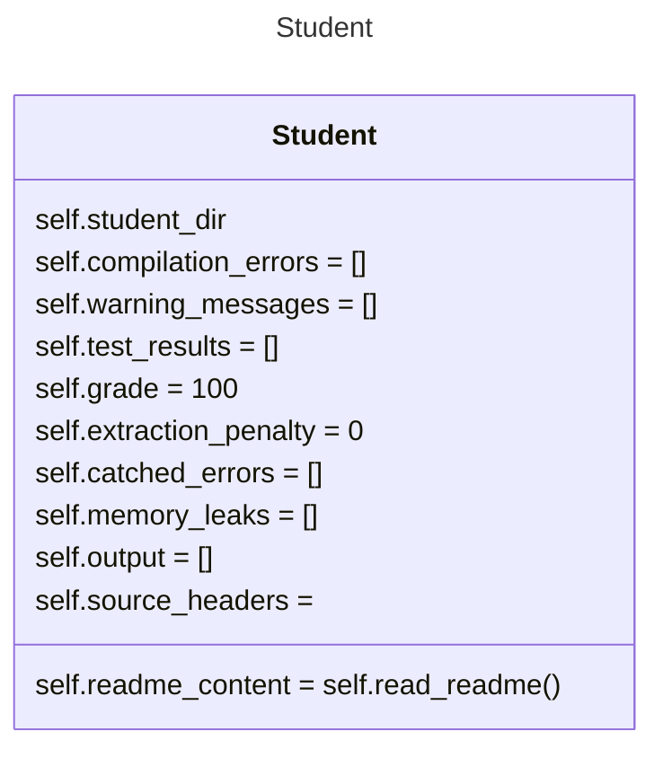
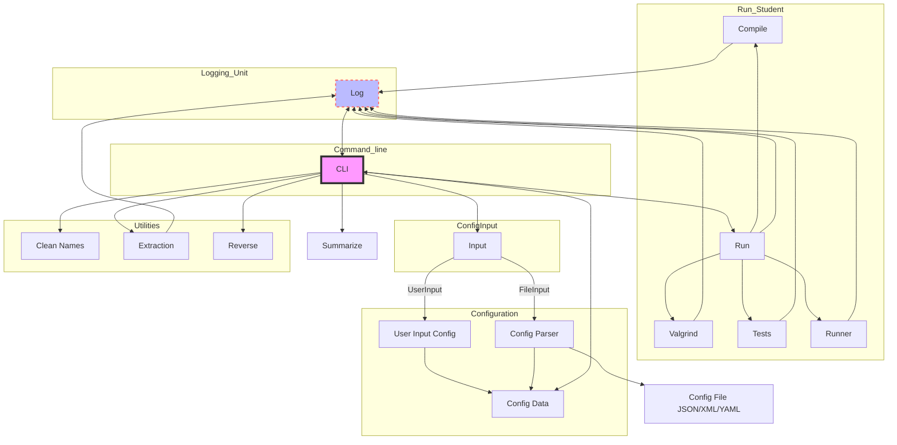

# O.S 1 Drill Checker

Graphs are created with [Mermaid](https://mermaid.js.org/).
This is the basic UML and planning of this project.
We will be using Docker and Python, to check the student assigments.

